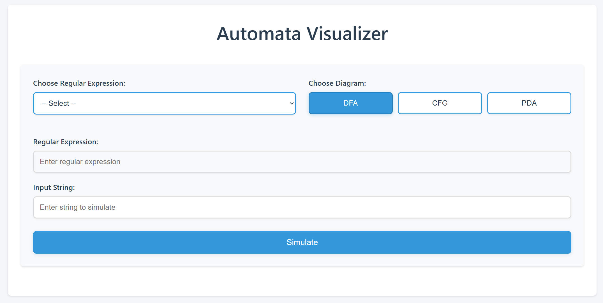

# 🤖 Automata System



Welcome to the **Automata System**!  
This project provides a powerful and user-friendly interface for working with automata, graphs, and related computational structures.

---

## 🚀 Features

- Visualize and manipulate automata and graphs
- Intuitive web interface powered by Flask
- Integration with popular Python libraries

---

## 🛠️ Installation

1. **Clone the repository:**
   ```bash
   git clone https://github.com/yourusername/automata_system.git
   cd automata_system
   ```

2. **Install dependencies:**
   ```bash
   pip install automata-lib blinker cached_method click colorama Flask frozendict graphviz itsdangerous Jinja2 MarkupSafe networkx numpy pillow pydot pyformlang pyparsing termcolor typing_extensions Werkzeug
   ```

   > **Note:**  
   If you encounter issues with `graphviz`, ensure you have the Graphviz system package installed from [Graphviz Download](https://graphviz.gitlab.io/download/).

---

## ▶️ Usage

Start the application with:

```bash
python main.py
```

Then open your browser and go to [http://localhost:5000](http://localhost:5000) to use the system!


## 🤝 Contributing

Pull requests are welcome! For major changes, please open an issue first to discuss what you would like to change.
